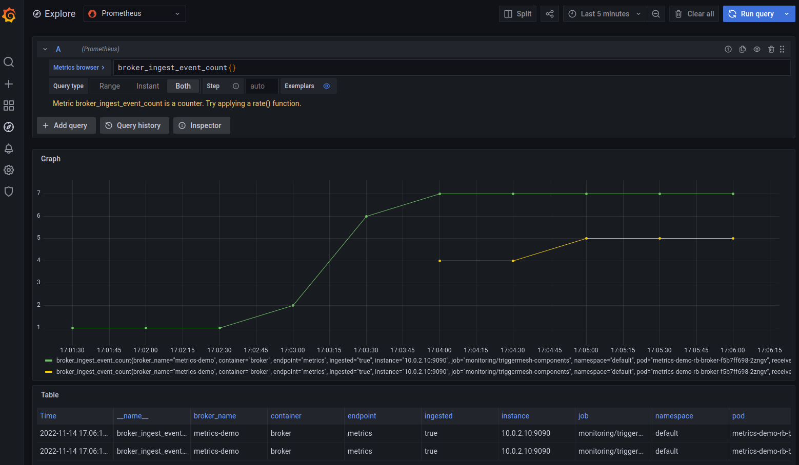

# Observable Broker

A Broker will be configured with custom logger settings and exposing metrics for Prometheus.

## Instructions

The solution will include:

* RedisBroker, that will accept and deliver events.
* ConfigMap that contains observability settings.
* Trigger, which subscribes to events and push them to a configured target.
* Target that consumes events.

### Broker and Prometheus

Create a ConfigMap that enables prometheus metrics at port 9090.

```console
kubectl apply -f https://raw.githubusercontent.com/triggermesh/triggermesh-core/main/docs/assets/manifests/observability/config-observability.yaml
```

Create a RedisBroker named `metrics-demo`.

```console
kubectl apply -f https://raw.githubusercontent.com/triggermesh/triggermesh-core/main/docs/assets/manifests/observability/broker.yaml
```

Wait until the RedisBroker is ready. It will inform in its status of the URL where events can be ingested.

```console
kubectl get redisbroker metrics-demo

NAME   URL                                                        AGE   READY   REASON
demo   http://metrics-demo-rb-broker.default.svc.cluster.local   10s   True
```

Prometheus can be easily installed following one of this methods:

* [Helm Charts](https://github.com/prometheus-community/helm-charts).
* [Prometheus Operator](https://github.com/prometheus-operator/prometheus-operator)
* [Kube Prometheus](https://github.com/prometheus-operator/kube-prometheus) manifests and scripts

All TriggerMesh Broker Pods expose the metrics port and are labeled like this.

```yaml
  labels:
    app.kubernetes.io/component: broker-deployment
    app.kubernetes.io/managed-by: triggermesh-core
    app.kubernetes.io/part-of: triggermesh
...
    ports:
    - containerPort: 9090
      name: metrics
```

Configure the Prometheus scrape to use the additional Pod monitors.

```yaml
  additionalPodMonitors:

  - name: triggermesh-components
    jobLabel: app.kubernetes.io/name
    namespaceSelector:
      any: true
    selector:
      matchLabels:
        app.kubernetes.io/part-of: triggermesh
    podMetricsEndpoints:
    - port: metrics
```

Refer to the Prometheus deployment method to access Grafana. When using the Helm chart, port-forwarding the grafana service and using the credentials from the `monitoring/kube-prometheus-stack-grafana` secret will.

```console
kubectl -n monitoring port-forward svc/kube-prometheus-stack-grafana 3000:80
```

```console
kubectl -n monitoring get secret kube-prometheus-stack-grafana -o jsonpath='{.data.admin-user}' | base64 -d

kubectl -n monitoring get secret kube-prometheus-stack-grafana -o jsonpath='{.data.admin-password}' | base64 -d
```

### Ingest Metrics

To be able to use the broker we will create a Pod that allow us to send events inside the Kubernetes cluster.

```console
kubectl apply -f https://raw.githubusercontent.com/triggermesh/triggermesh-core/main/docs/assets/manifests/common/curl.yaml
```

It is possible now to send events to the broker address by issuing curl commands. The response for ingested events must be an `HTTP 200` which means that the broker has received it and will try to deliver them to configured triggers.

```console
kubectl exec -ti curl -- curl -v http://metrics-demo-rb-broker.default.svc.cluster.local \
    -X POST \
    -H "Ce-Id: 1234-abcd" \
    -H "Ce-Specversion: 1.0" \
    -H "Ce-Type: demo.metrics1" \
    -H "Ce-Source: curl" \
    -H "Content-Type: application/json" \
    -d '{"test1":"ingress"}'
```

Use different `Ce-Type` values and send a number of event requests to be ingested by the broker, then open Grafana's metrics explorer and show `broker_ingest_event_count` metrics.



Incoming requests expose metrics:

* `broker_ingest_event_count` for a global count of incoming requests.
* `broker_ingest_event_latency_bucket` for the incoming requests latencies bucket.

### Trigger Metrics

We will create a target service and a Trigger pointing to it in order to gather Trigger metrics.

```console
# Event display service
kubectl apply -f https://raw.githubusercontent.com/triggermesh/triggermesh-core/main/docs/assets/manifests/common/display-target.yaml

# Trigger using event display service
kubectl apply -f https://raw.githubusercontent.com/triggermesh/triggermesh-core/main/docs/assets/manifests/observability/trigger.yaml
```

The Trigger configures a filter that will deliver any event whose type is prefixed `demo.`

```yaml
spec:
  broker:
    kind: RedisBroker
    group: eventing.triggermesh.io
    name: metrics-demo
  filters:
  - any:
    - prefix:
        type: demo.
```

Just as before, use the `curl` pod to produce events with different `Ce-Type` values that start with `demo.`. Then use Grafana's  metrics explorer and show `broker_ingest_event_count` metrics.


Incoming requests expose metrics:

* `broker_trigger_event_count` for a global count of outgoing events.
* `broker_trigger_event_latency_bucket` for the outgoing events latencies bucket.

## Clean Up

To clean up the getting started guide, delete each of the created assets:

```console
# Removal of display-target not in this list, since it was deleted previously.
kubectl delete -f \
https://raw.githubusercontent.com/triggermesh/triggermesh-core/main/docs/assets/manifests/observability/trigger.yaml,\
https://raw.githubusercontent.com/triggermesh/triggermesh-core/main/docs/assets/manifests/common/display-target.yaml,\
https://raw.githubusercontent.com/triggermesh/triggermesh-core/main/docs/assets/manifests/observability/broker.yaml,\
https://raw.githubusercontent.com/triggermesh/triggermesh-core/main/docs/assets/manifests/observability/config-observability.yaml,\
https://raw.githubusercontent.com/triggermesh/triggermesh-core/main/docs/assets/manifests/common/curl.yaml
```
